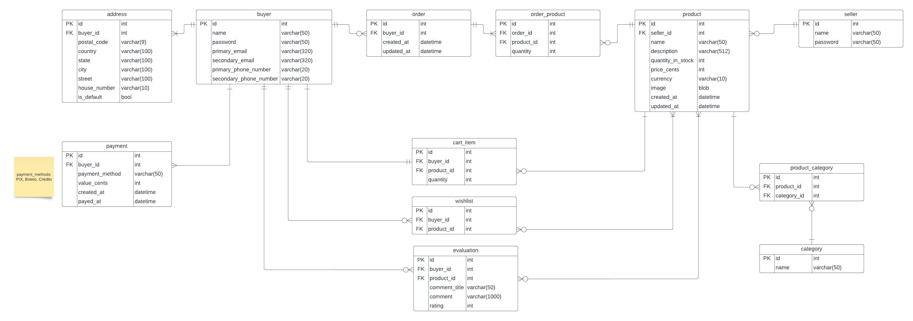

# EduStore

[](https://github.com/EduardoPeresLima/EduStore/stargazers)  [](https://github.com/EduardoPeresLima/EduStore/issues)

A **full-stack e-commerce** application built with **Angular**, **FastAPI**, and **MariaDB**. Designed following Clean Architecture principles for scalability, maintainability, and testability.

---

## 🚀 Live Demo

Access the live application: [edu-store-ivory.vercel.app](https://edu-store-ivory.vercel.app)

---

## 🛠️ Tech Stack

* **Frontend**: Angular 16, TypeScript, SCSS
* **Backend**: FastAPI, Python 3.10
* **Database**: MariaDB
* **Infrastructure**: Docker, Docker Compose, Alembic migrations
* **Authentication**: JWT
* **Architecture**: Clean Architecture, Dependency Injection

---

## 📂 Project Structure

```
├── frontend/           # Angular application
│   ├── src/app         # Components, services, modules
│   └── package.json
├── backend/            # FastAPI application
│   ├── src/routes      # REST endpoints
│   ├── src/controllers # Domain models, schemas, business logic
│   ├── src/repository  # Database setup, migrations (Alembic)
│   └── requirements.txt
├── database/           # Dockerfile and scripts for database startup
├── docker-envs/        # Docker Compose environment configs
├── .github/workflows/  # CI/CD pipelines
├── docker-compose.yml  # Local development orchestration
└── README.md           # This file
```

---

## ⚙️ Local Installation & Setup

### Prerequisites

* Node.js >= 18
* npm >= 9
* Python 3.10+
* Docker & Docker Compose
* MariaDB

### Run with Docker

```bash
# From project root
npm run prod
```

* Frontend: [http://localhost:4200](http://localhost:4200)
* Backend Swagger: [http://localhost:8000/docs](http://localhost:8000/docs)

### Run Locally

1. **Database**

   ```bash
   # Install MariaDB and create database
   mysql -u root -p
   CREATE DATABASE edustore;
   ```

2. **Backend**

   ```bash
   cd backend
   python -m venv venv
   source venv/bin/activate  # Linux/macOS
   venv\Scripts\activate    # Windows
   pip install -r requirements.txt
   alembic upgrade head
   uvicorn src.api:app --reload --host 0.0.0.0 --port 8000
   ```

3. **Frontend**

   ```bash
   cd frontend
   npm install
   npm run dev
   ```

* Frontend: [http://localhost:4200](http://localhost:4200)
* Backend Swagger: [http://localhost:8000/docs](http://localhost:8000/docs)
---

## ✨ Key Features

* User authentication & authorization (JWT)
* Product catalog with search & filtering
* Shopping cart & checkout workflow
* Order history and user profile management
* Admin dashboard for product & order management

---

## 📐 Architecture

This project uses **Clean Architecture** to separate concerns:

* **Routes Layer** handles HTTP requests and responses.
* **Controllers Layer** contains business rules and domain models.
* **Repositories Layer** integrates with external systems (DB, mail, etc.).

---

## 📊 Database ER Diagram



---

## 📝 Contributing

Contributions are welcome! Please open an issue or submit a pull request.

1. Fork the repository
2. Create a feature branch (`git checkout -b feature/YourFeature`)
3. Commit your changes (`git commit -m 'Add YourFeature'`)
4. Push to the branch (`git push origin feature/YourFeature`)
5. Open a Pull Request

---

> Developed by Eduardo Peres de Lima
